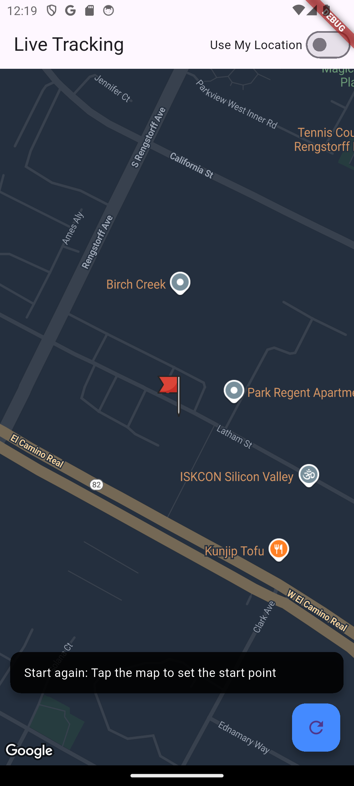
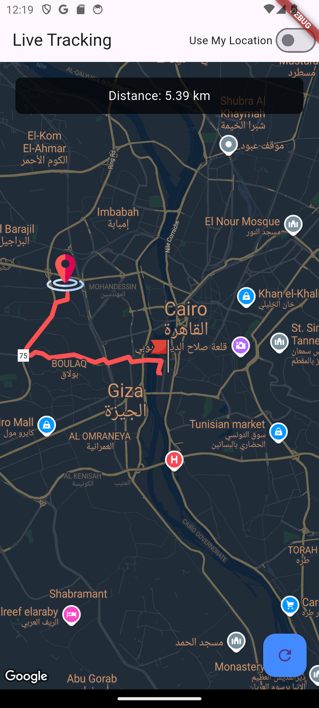

# 📍 Live Location Tracking App – Flutter + Google Maps

A Flutter-based mobile application that provides real-time location tracking with a moving marker, route visualization using polylines, and live distance calculation between the current location and a selected destination.

---

## 📸 Screenshots

  
    
  

## 🚀 Features

-  **Live tracking** with real-time updates using device GPS.
-  **Moving marker** that represents the current user location.
-  **Destination marker** selection via tapping on the map.
-  **Distance calculation** (in kilometers).
-  **Polyline route drawing** using Google Directions API.
-  **Custom Google Map style** & personalized marker icons.
-  **Reset functionality** and toggle between:
  - Manual source selection
  - Auto location detection (using GPS)

---

## 🛠️ Tech Stack

- ✅ Flutter
- ✅ Google Maps SDK
- ✅ Google Directions API
- ✅ Flutter BLoC (Cubit) for state management
- ✅ Location & Geolocator packages

---

